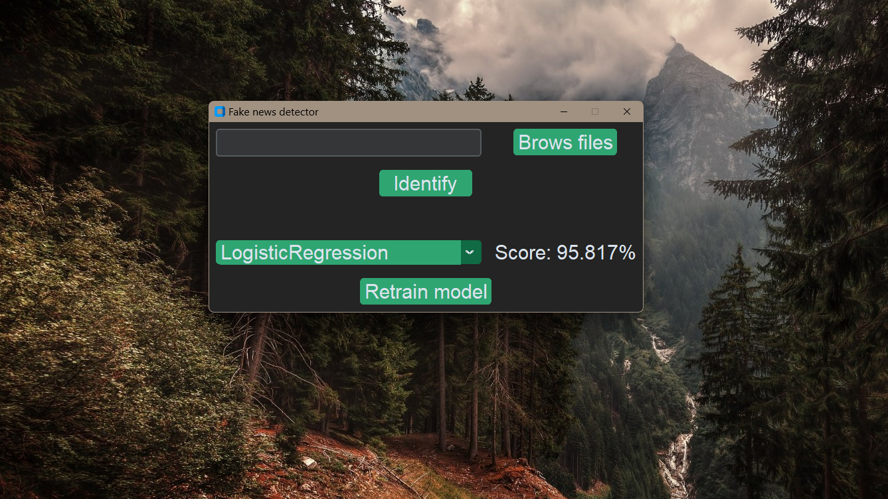

# Fake News Detector



## Table of contents

- [Description](#description)
- [Download and install](#download-and-install)
- [Usage](#usage) 

## Description

Fake news detection is app to distinguish between fake and real news. Under the
hood are machine learning models which are trained on news dataset.  

## Download and install

### Python interpreter

Need to have installed python. Newest version is the best choice. I was working
on 3.12.2.

### Cloning the repo

```bash
git clone https://github.com/DaliborBilicky/FakeNewsDetector.git
```

### Installing libraries

**Note:** I recommend creating a virtual environment and than installing the 
libraries

[Tutorial how to make virtual environment](https://docs.python.org/3/tutorial/venv.html)

```bash
pip install -r requirements.txt
```

### Usage

To start app open terminal and run this command.

```bash
python src/main.py
```
#### Using UI

When you start app, wait until app prepares all the necessary things. Than you
can start using the app.

- **Entry:** put there url or path to article.
- **Brows files:** is for easier finding of your files.
- **Identify:** press it to evaluate whether the article is FAKE or REAL
- **Setting:** you can pick classifier and look on score. If something goes wrong
and score is to low, try using **Retrain model** button.
